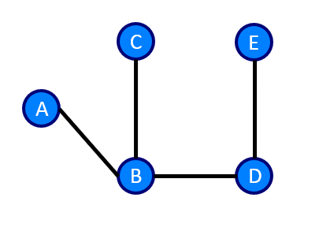

# Introduction
This series of blogs aims to cover most of the foundational material covered in the graph theory portion of an undergraduate level CS course in data structures.

The goal is to provide a more in-depth understanding of the concepts, alongside real-world implementations of the theory.

Prequisites for this course are a basic understanding of simple data structures (Arrays, Linked-Lists, Queues, Stacks), and a working proficiency in Python.

# What is a graph?
## Definition
To understand what graphs are, let's look at the mathematical definition, and disassemble the meaning. From [Wikipedia](https://en.wikipedia.org/wiki/Graph_theory#:~:text=In%20mathematics%2C%20graph%20theory%20is,also%20called%20links%20or%20lines):

> Graphs are mathematical structures used to model *pairwise relations* between *objects*.

The key words here are pairwise relationships, and objects. A graph is made up of nodes (the circles), and edges (the lines). We can see this on an example graph below made up of 3 edges and 3 nodes.

 

The nodes may be alternatively known as vertices or points, and the edges may also be known as links, arcs or lines.

In the figure above, the nodes represent whatever **object** we may be trying to model. For example, this could be a group of friends. The nodes represent each person, and the edges represent that they have a relationship. This is the basis behind creating more complex graphs such as those used to model relationships and how many degrees of separation you may be from another persion.

Not that a line will only be draw between one node and another. This defines **pairwise relations**. A graph will only show relationships between a pair of nodes in the graph.

## Weighted Edges
Occasionally, a graphs will have weighted edges. They indicate a specific attribute of the connection between two nodes. Taking our previous example, we could create a graph as follows

  

Note now we have named our nodes as well. **A**lice, **B**ob and **C**harlie. The weighting on each edge represents the strength of the relationship. We can see that Alice has very strong relationships with both Bob and Charlie, but Bob and Charlie don't really like each other. 

Another use for weighted edges could also be to represent distance between locations. Using the graph above, we could see that location A is far away from both location B and location C, but B and C are very close to each other.



# Types of Graphs
## Directed and Undirected graphs

The graphs we have discussed so far are good at modelling **undirected** relationships betwee two nodes. The relationship works both ways. This is why such graphs are called **undirected graphs** What if we wanted to model a one way relationship? For example, what if had a situation where Alice thought she was good friends with Bob and didn't care for Charlie. Bob didn't care for Alice, but thought he was good friends with Charlie. Charlie meanwhile liked Alice, but was also good friends with Bob. This sort of one way relationship between nodes may be shown using a **directed graph**. Please note the double edges on the relationship between B and C. This can also be represented as two distinct directed arrows, one from B to C and one from C to B.


Directed graphs, can also be known as **digraphs**. Another good example for digraphs would be an instagram celebrity. They will have thousands of followers but they may only be following a handful of other people.

### Traversing a Graph
There are a variety of terms we need to understand as it pertains to traversing a graph. In this section, we will always refer to the graph below during our traversals.

  

1. **Walk**: A walk through a graph is taking a sequence of nodes and edges through the graph. The nodes and edges we take may be repeated. So for example in the graph above, a traversal like ```
[A, B, C, A, C, D, E, A]``` would be classified as a walk. Walks themselves have two different definitions

   * **Open Walk**: An open walk is a walk where the starting and ending vertices are different. For example, a traversal like ```[A, B]``` would be classified as an open walk.
   * **Closed Walk**: A closed walk is a walk where the starting and ending vertices are the same. For example a traversal like ```[A, B, A]``` would be classified as a closed walk.

1. **Trail**: A trail is an walk in which no edge may be repeated. So the traversal ```[A, B, C, A, E]``` would be classified as a trail, even though we have repeated node A. Generally we will refer to trails as **open trails**, i.e. a trail that is also an open walk, but you can also have **closed trails**.
   
2. **Circuit**: A circuit is a closed trail. Nodes may be repeated in a circuit, but edges may not. An example of a closed trail would be ```[A, B, C, A, D, E, A]```.
   
3. **Path**: A path is a trail that does not repeat any nodes. Remember that a trail does not repeat any edges so a path does not repeat any nodes **OR** edges. When we say path, we are generally referring to an **open path**.
   
4. **Cycle**: A cycle is a closed path. It starts from the same node that it ends at, while not repeating any nodes or edges. ```[A, B, C, D, E, A]``` would be a valid cycle.

These concepts readily transfer over to directed graphs as well, with the restriction being that we can only travel in the direction of the edge.

<fieldset class="field-set" markdown="1">
<legend class="leg-title">DAGS</legend>

A directed graph without cycles is known as a **D**irected **A**cyclic **G**raph (DAG)
</fieldset>

# Trees
## General Trees
We will define a tree in graph theory to mean an undirected graph wherein there are no cycles. Formally it can be defined as a **connected acyclic undirected graph**. We are used to seeing trees with one node at the top, and each node below it having a specific number of child nodes. Trees do not necessarily need to have such a structure. For example, the following is a valid tree.



## Rooted Tree
A rooted tree, is a DAG in which we single out a specific node to classify as the **root** node. An example of a rooted tree is shown below

  


## Polytrees
If we have a graph that is a DAG, and whose underlying graph is a tree (meaning no disjoint vertices), we can refer to it as a **polytree** polytrees (also **directed tree**, **oriented tree** and **singly connected network**). An example of a polytree is show below.

  

## Arborescence
If we have a rooted polytree, we name it a **directed rooted tree**. These represent trees we generally encounter in CS, for example binary trees. When we draw binary trees, we don't generally draw the directed edges to signify direction, but they are there implicity.

The direction that we assign the edges will alter how we define the tree. When all the edges are pointing away from the root node the directed rooted tree is known as an **arborescence** or **out-tree**. When they are all pointing towards the root node, the directed rooted tree is known as an **anti-arborescence** of **in-tree**.

  

Keep in mind that in a directed rooted tree, all edges have to be pointing away from or towards the root node simultaneously. You cannot have any edges pointing against the "natural direction".

Also note from this definition, that every arborescence is a DAG, but not every DAG is an arborescence.

## Bipartite Graphs
Suppose you are a data scientist with the NFL, and you are mapping which players have played with which team. You set about showing all of these relationships on a graph. For simplicity, I have given an example with 5 players (blue) and 5 teams (red). Note that players may have played for multiple teams.

 

The interesting thing to see here is that the vertices corresponding to players and teams can be very distinctly split, forming two **disjoint** and **independent** sets. Also see that every edge in the graph connects a vertex in the Players set to a vertex in the Teams set. This is in fact the definition of a **bipartite graph** (also known as **two-colorable graph**). From [Wikipedia](https://en.wikipedia.org/wiki/Bipartite_graph):

> A **bipartite graph** or **bigraph** is a graph whose vertices can be divided into two disjoint and independent sets $U$ and $V$ such that every edge connects a vertex in $U$ to a vertex in $V$.

A necessary and sufficient condition for bipartite graphs is that there are no odd length cycles. In other words, a graph is bipartite if and only if there are no odd cycles.

## Complete Graphs
If **ALL** the vertices are pairwise connected by an edge, the resulting graph is known as a complete graph. A complete graph with $n$ vertices, is denoted by $K_n$. Additionally, a complete graph with 0 vertices is known as a **null graph**, and a complete graph with 1 vertex is known as a **singleton graph**. 

Both are considered to be **trivial graphs** (a finite graph that contains only one vertex and no edge). A **simple graph** is a graph that does not contain more than one edge between a pair of vertices, and is what we will be exploring further.

A graph in this context is made up of vertices (also called nodes or points) which are connected by edges (also called links or lines
